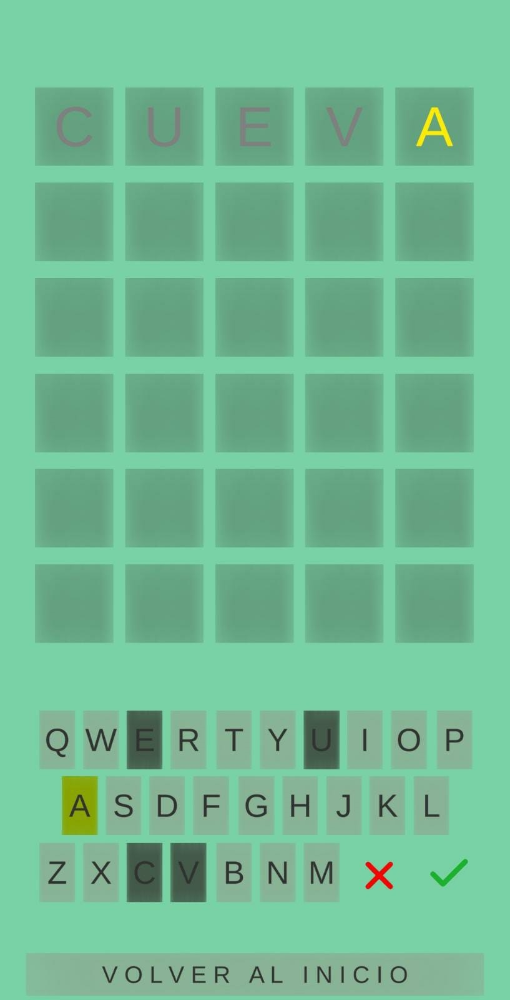
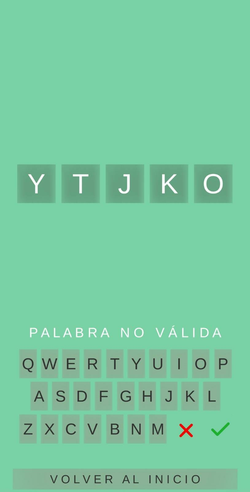

<h1 align="center">Wordy [Unity 2020.3.21f1]</h1>

App here: https://play.google.com/store/apps/details?id=com.JaviSerrano.Wordy

<h2>What is this about?</h2>

Once Wordle by @danielfrg came out I couldn't stop playing every day, I didn't miss any day, but this one-word-per-day dynamic was frustrating to me. That is why I decided to build an app for me, implementing my own version Wordy. I built this in my days I was trying to learn some Unity so the code and implementation is not the best, not even good, but it works. It's only a spanish version.

<h2>What did I implement?</h2>
<ul>
  <li>Classic Mode, as known by all players, that can be played for infinity as it generates new words every time.</li>
  <li>Daily Mode, as known by all players, that only generates the same word in the day.</li>
  <li>Memorize Mode, that only gives feedback of the last word put, so you have to memorize this results.</li>
</ul>

  
  
  
  
  

